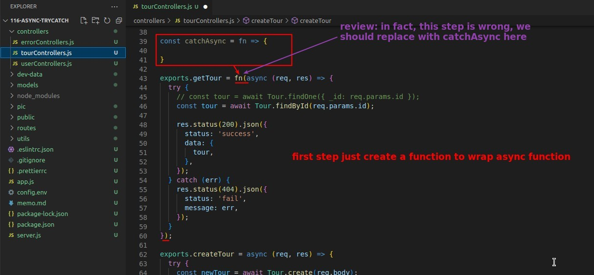

## **DRY problem in Controller Async Functions**

## **Solution Step by Step**

## **Still Not Work!?**

## **Export catchAsync to New file in utils**

## **Rewrite all Async Functions in Conrtroller**

