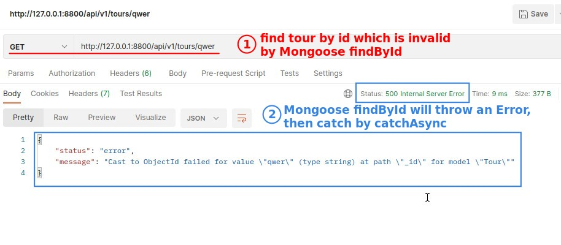
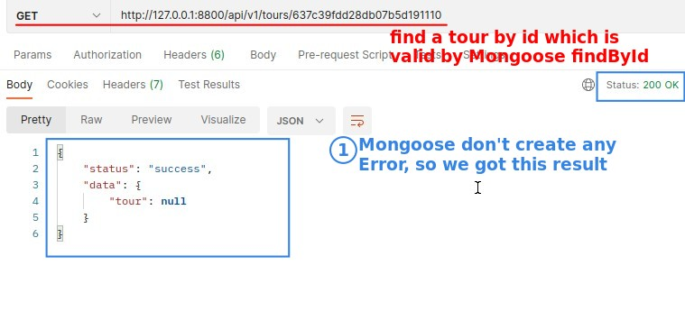
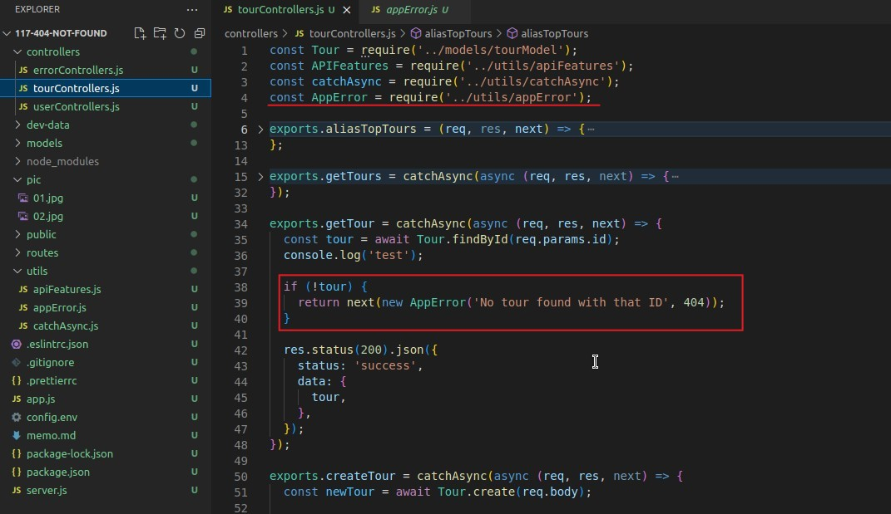
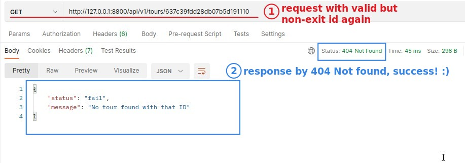
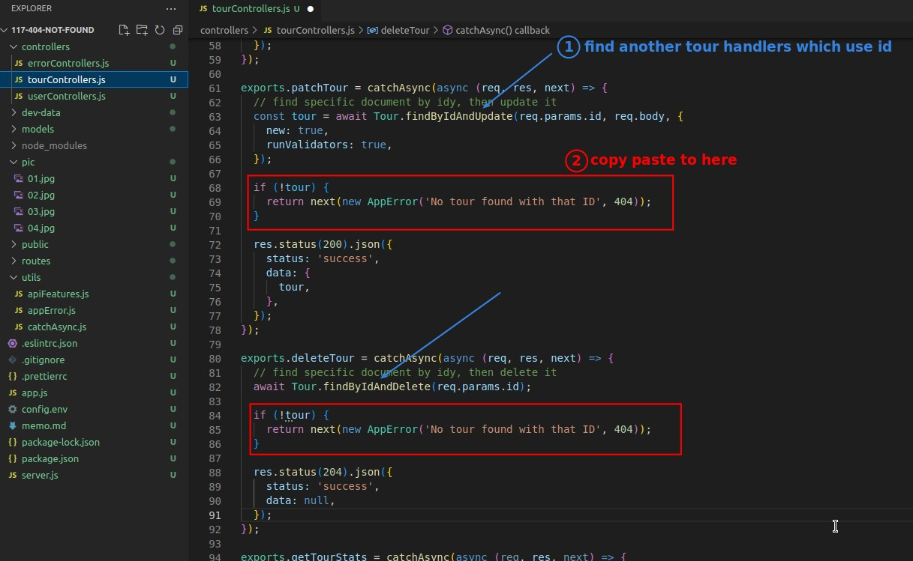
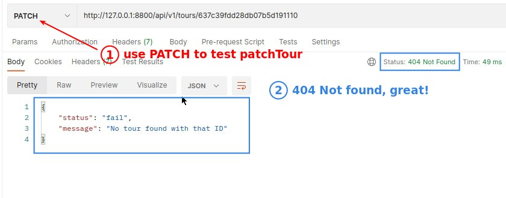
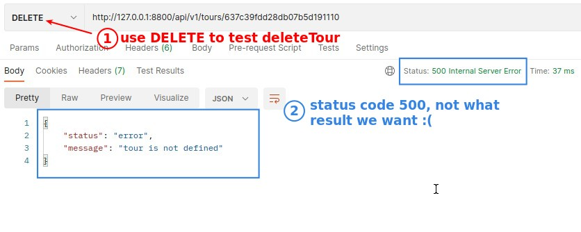
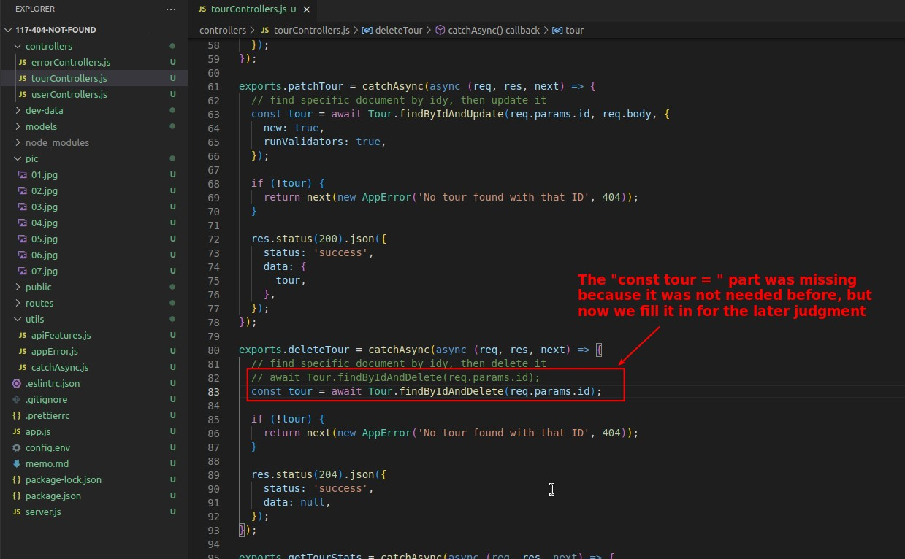
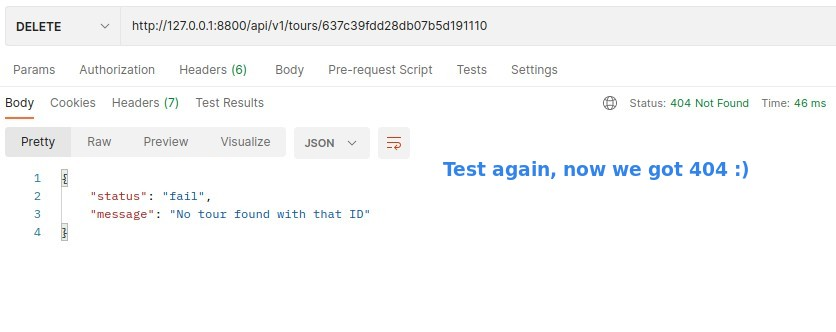

## **Problem Description**

> We start with the handler "getTour" in the controller.

### _Invalid ID_

### _Valid ID_

## **Use AppError to Create Error Object**

## **Other Tour Handlers Using ID**

