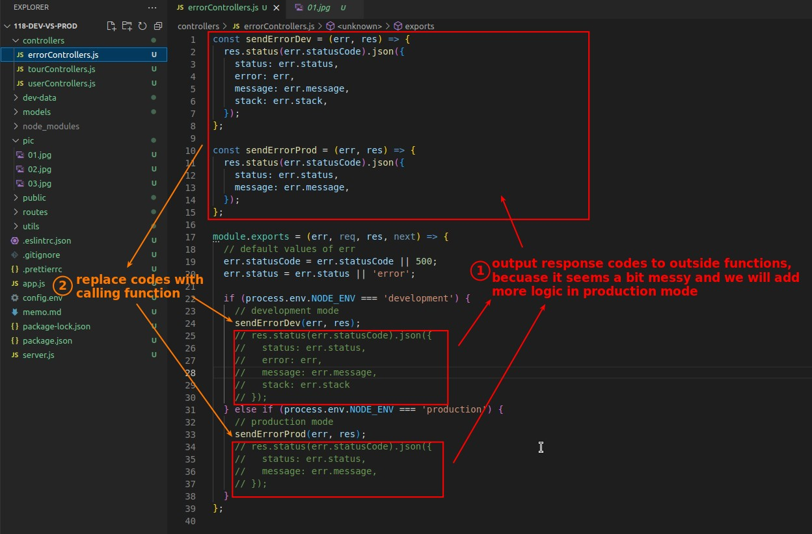

## **Development mode vs. Production mode**

## **Seperate the Error responsing ways in different modes**

## **Seperate the Error responseing ways with Types of Error**

## **Still Need to Mark some Errors "isOperational"**

