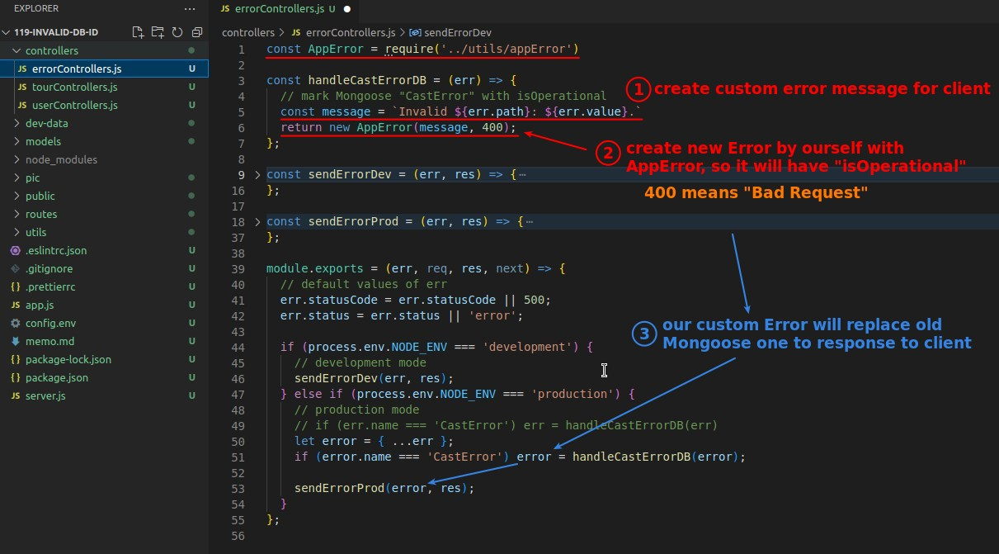

## **Description: Mongoose Id un-recognized error**

- So we need to use the property "name: CastError" to catch this type of Mongoose error.
- Then use AppError to create a new error with "isOperational" and a more appropriate error message for the client.

## **Mark Error with "isOperational" (Create new Error with AppError)**

### _catch Mongoose error by "name: CastError"_

### _Fix bad practice (assign value to arg) with hard copy_

### _Create new error by AppError_

## **Bug: error.name disapper**

- The result of the console.log test shows that in production mode, the name property of the Mongoose error object disappears, and "CastError" appears directly in the AppError's constructor property name.
  - You can details Q&A here:
    - https://www.udemy.com/course/nodejs-express-mongodb-bootcamp/learn/lecture/15065218#questions/11651594

## **Fix Bug: Copy with "Object.assign" and Test**

- Using "Object.assign" instead of object destructure's copy will get us the property "name: CastError" we need back.

