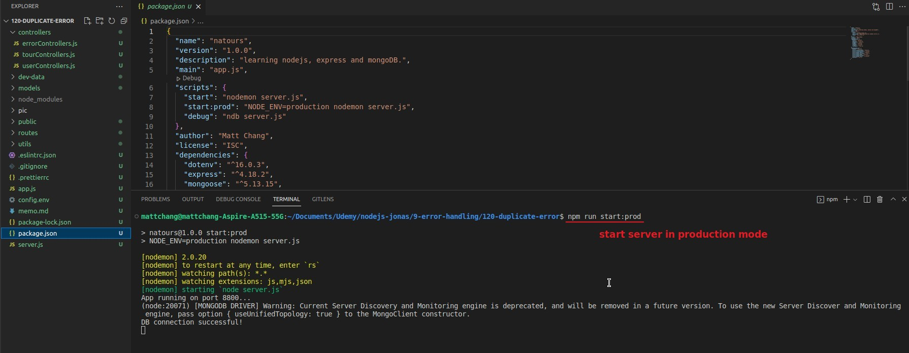
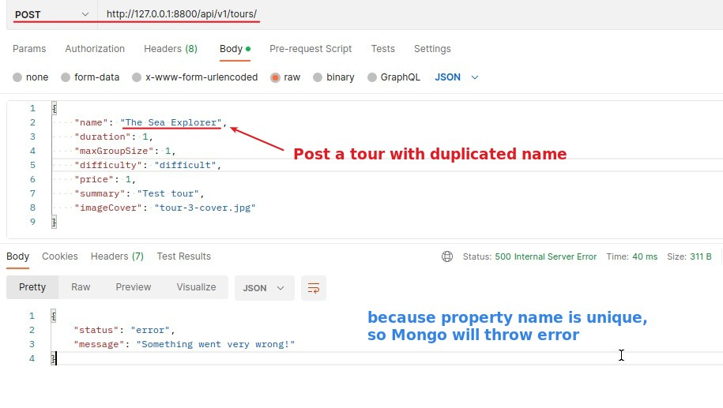
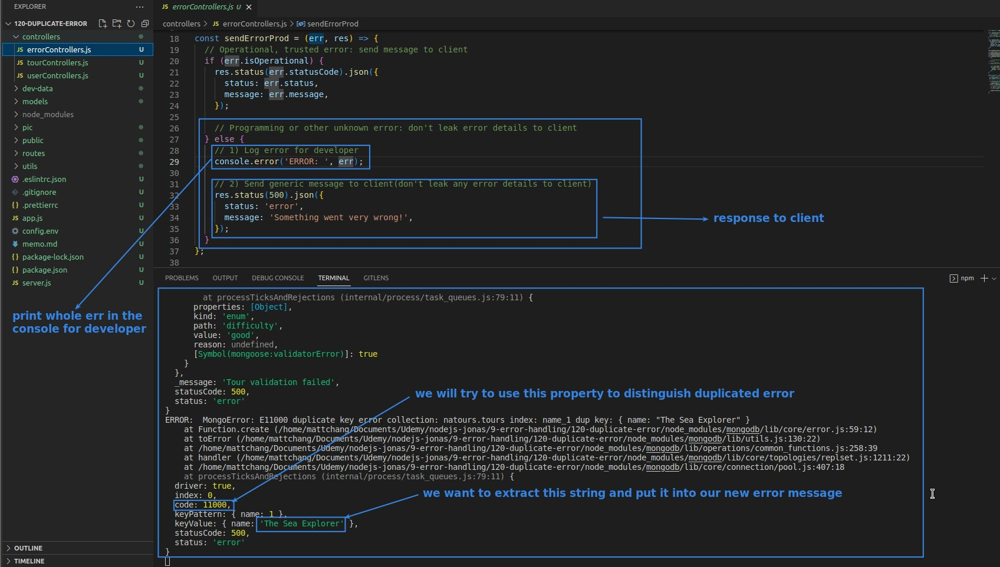
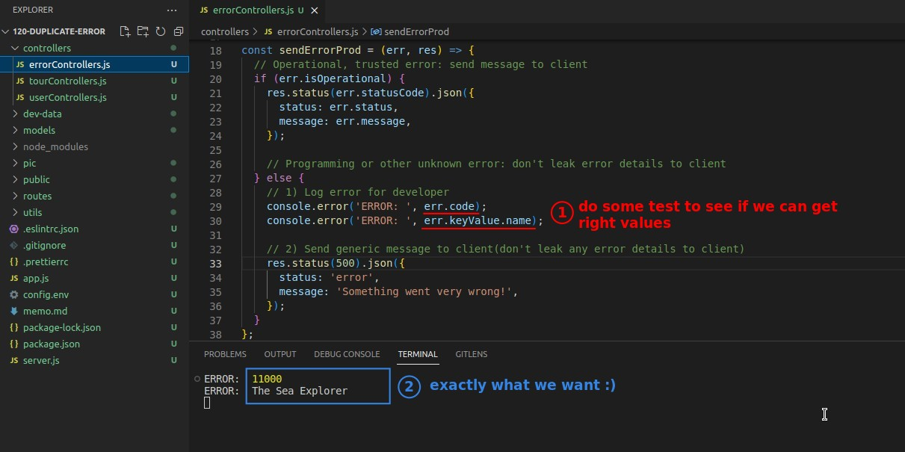
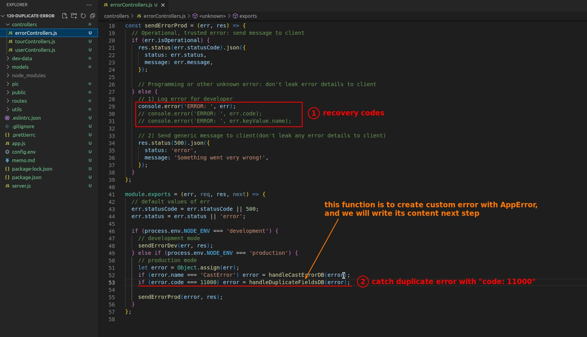
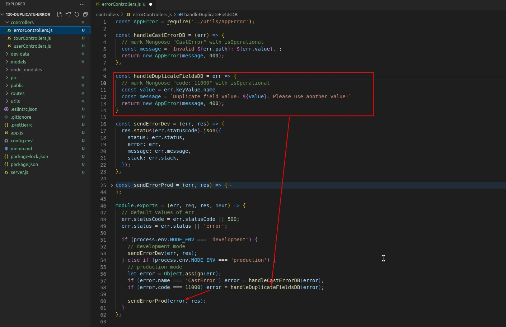
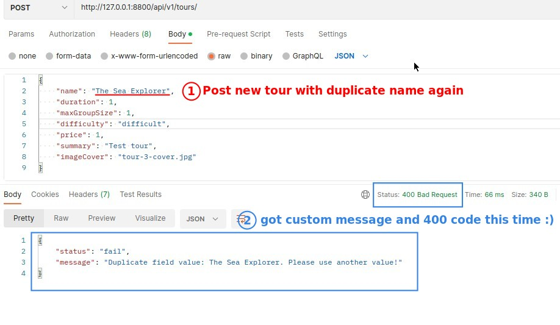

## **Mongoose error: Duplicate name**

## **Analyze err in the console**

## **Catch duplicate error with "code: 11000"**

## **Create new error with AppError**

## **Final Test with Postman**

