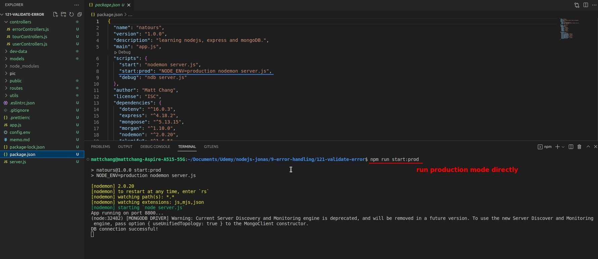
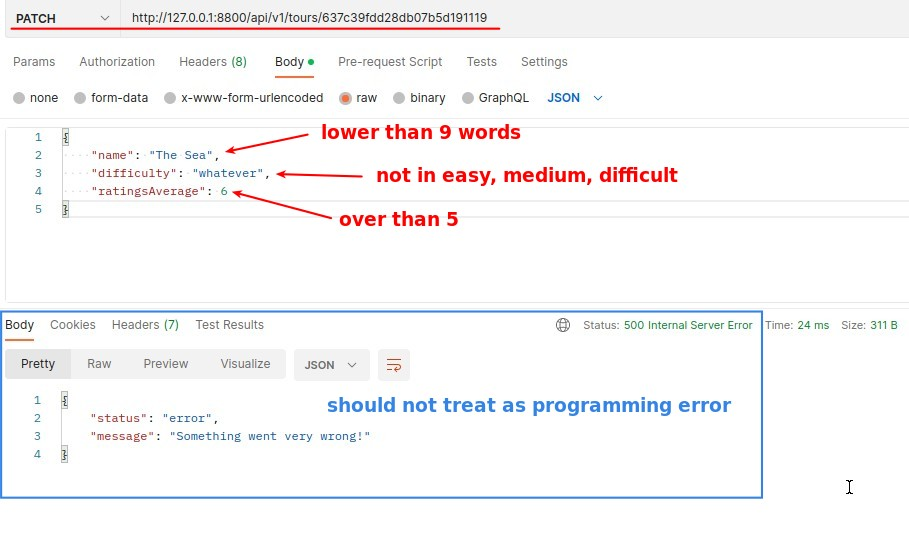
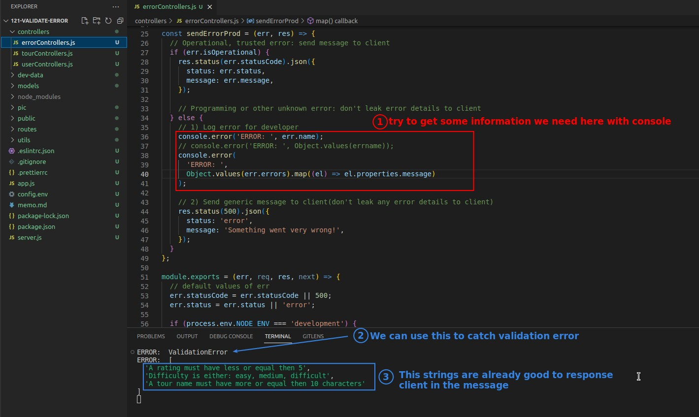
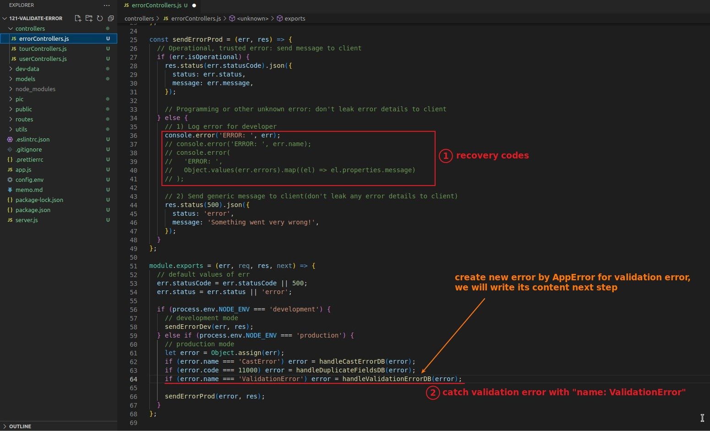

## **Mongoose Error: ValidationError**

- lecture is using "npm start" (development mode) to do the analysis, it seems that you can see the err information more clearly on Postman.

- Because validation error is also an error that we expect to occur, it should be an operational error.

## **Try to get usefull info with console**

- Object.values takes the values underneath the object passing into it, split and regroup into an array
- We can try here until we get the information we want.

## **Catch Validation Error with "name: ValidationError"**

- Similar to the first Mongoose generated CatchError, both use the property "name" to catch the Mongoose generated error

## **Create Error by Ourself with AppError**

- Object.values will get an array, so remember to use "join" to form the array into a complete string, in order to put it into the message of the response

## **Mongoose Errors Finish, But...**

- There are still some errors that are not generated by Mongoose or Express, but they should be operational errors, and we will deal with them in the remaining lectures in this chapter.
