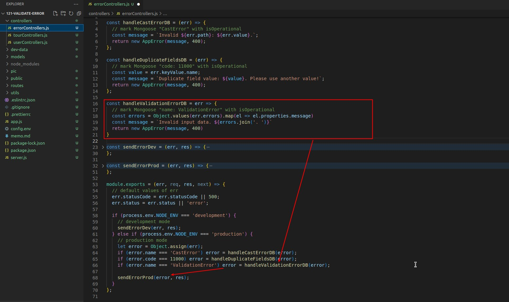
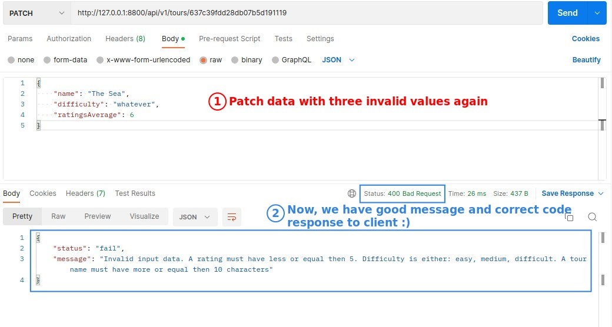

## **Mongoose Error: ValidationError**

- lecture is using "npm start" (development mode) to do the analysis, it seems that you can see the err information more clearly on Postman.

- Because validation error is also an error that we expect to occur, it should be an operational error.

## **Try to get usefull info with console**

- Object.values takes the values underneath the object passing into it, split and regroup into an array
- We can try here until we get the information we want.

## **Catch Validation Error with "name: ValidationError"**

## **Create Error by Ourself with AppError**

