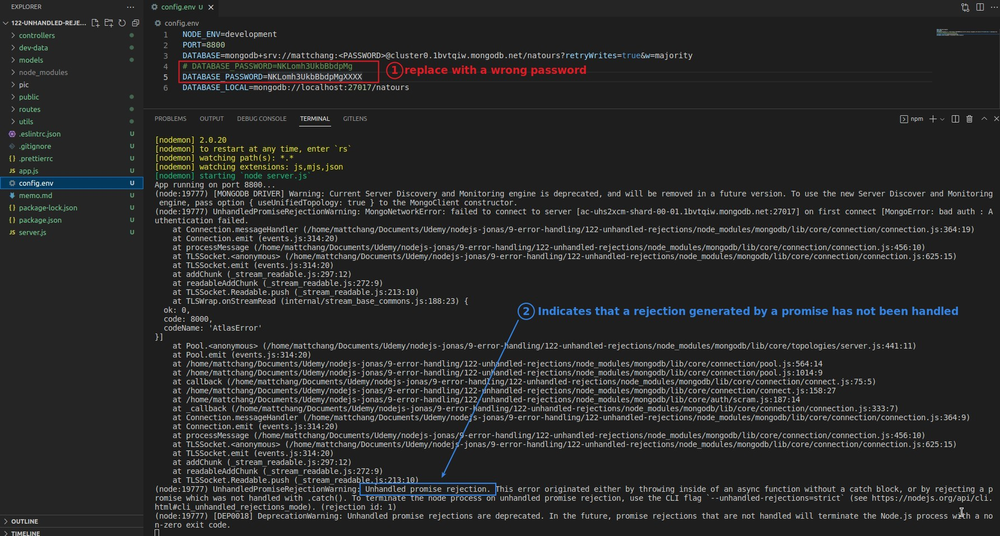
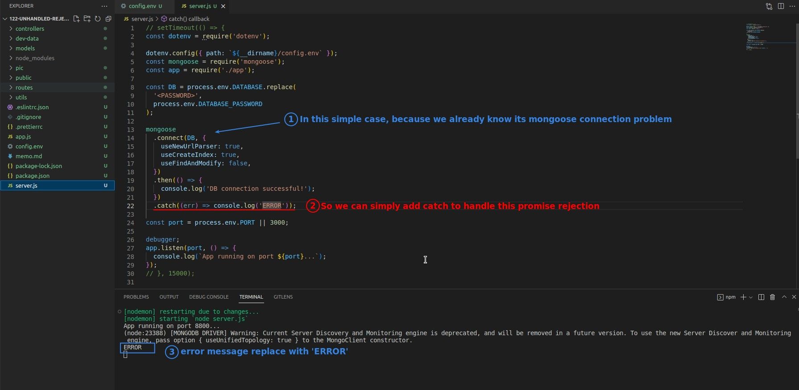
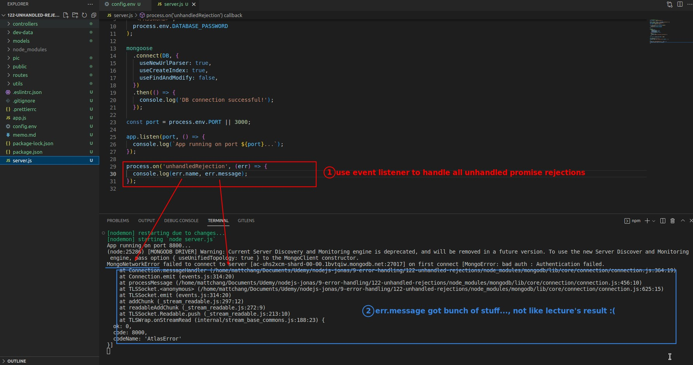
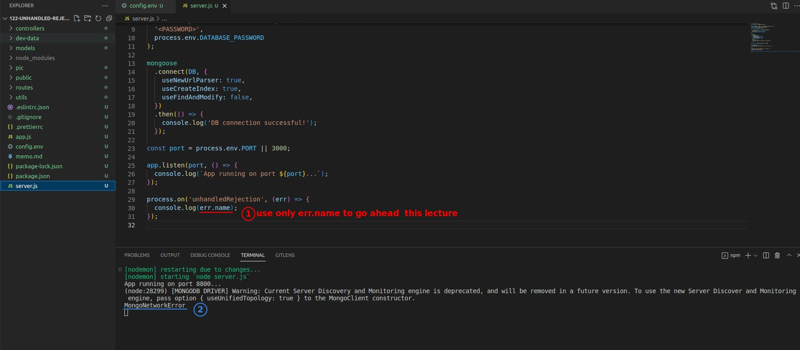
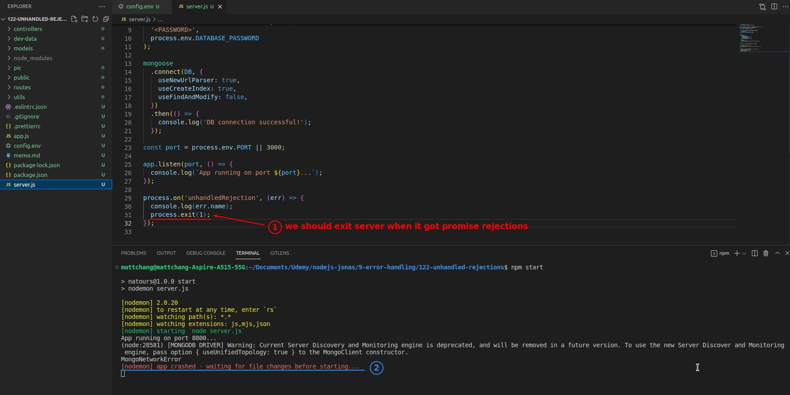
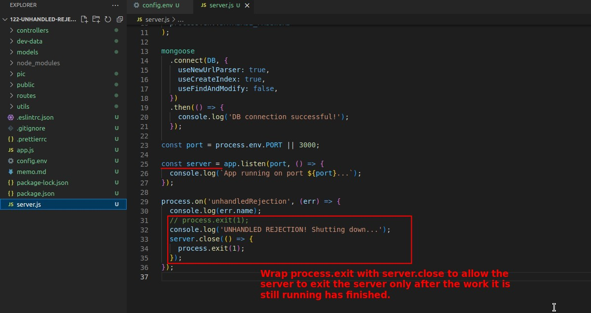
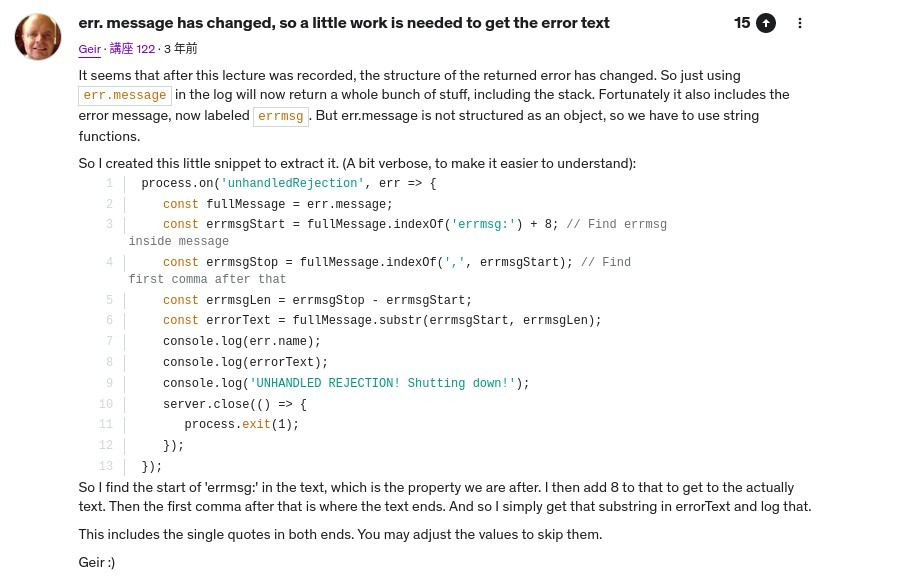
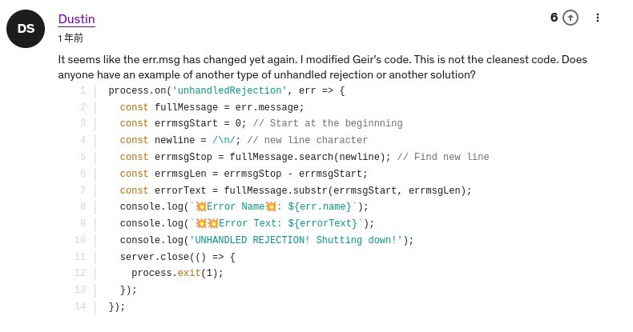
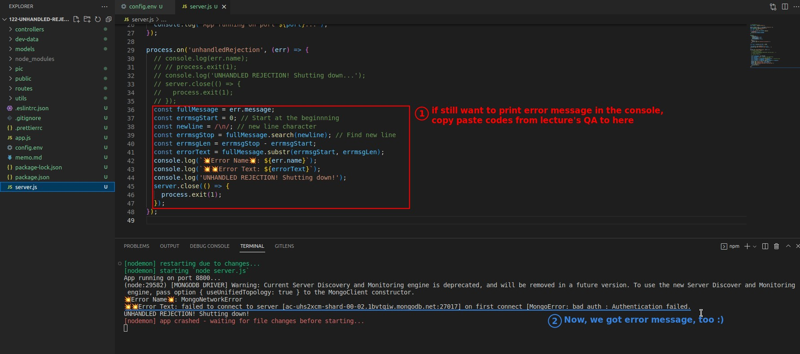

## **Create a Promise Rejection**

## **Handle Promise Rejections**

### _By Catch_

- Because promise rejection is our own creation, so we know where the problem lies in order to do so, but the reality of the situation is often do not know where the problem lies.

### _By Listener_

> Use listener to catch all promise rejections, which is more generic and global.

- However, the result presented by err.message in the above figure is different from that in the lecture, probably because of the version difference.

- Let's continue this course using only err.name.

## **Exit Server**

### _Abrupt exit_

- But this way of ending the server is a bit abrupt and brutal, some requests and pending being handled will be aborted directly.

### _Gracefully exit_

## **How to get error message?**

### _Check lecture's QA_

https://www.udemy.com/course/nodejs-express-mongodb-bootcamp/learn/lecture/15065226#questions/8728560

- Obviously, it has become a task to retrieve the error message from a very long string.

### _Copy paste from QA_

> But since someone has already finished the task, directly copy paste over to meet the habits of engineers :)

