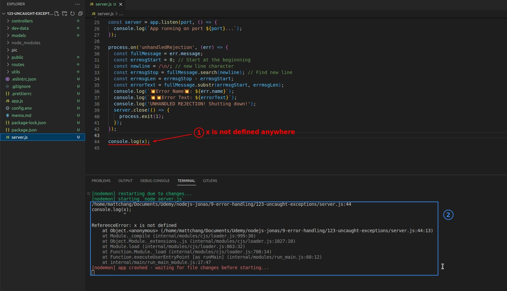
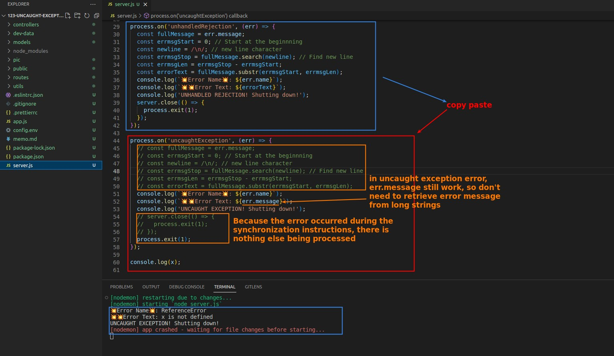
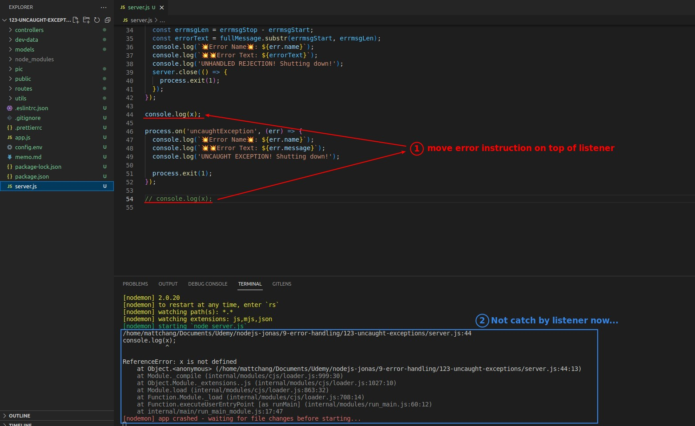
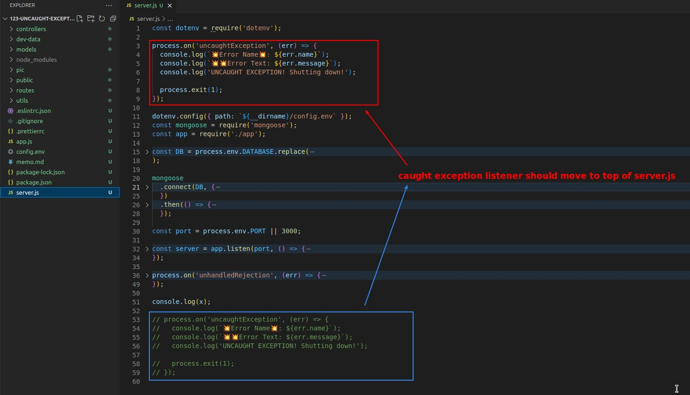
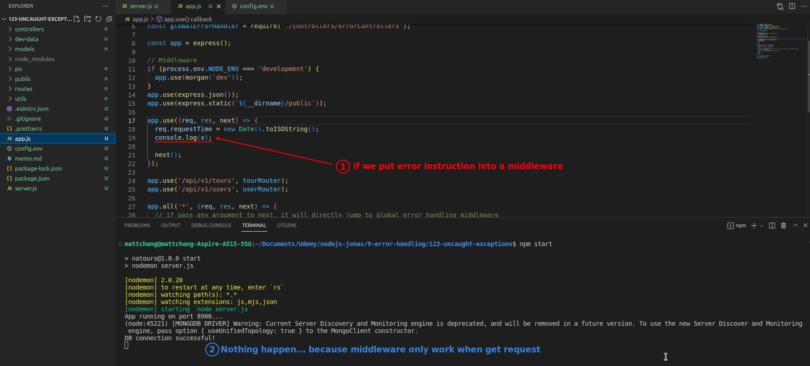
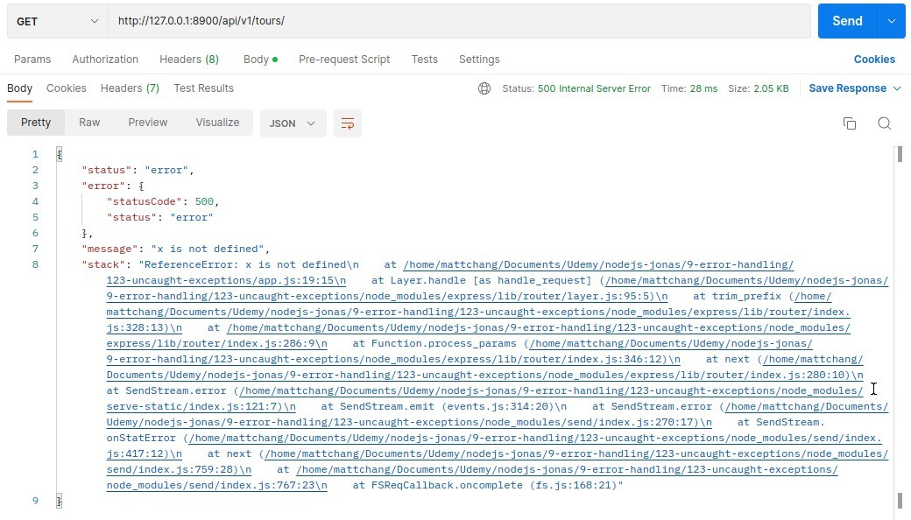
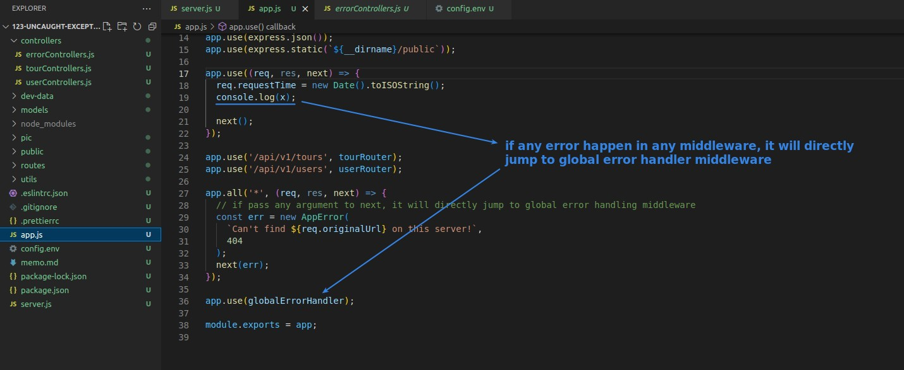
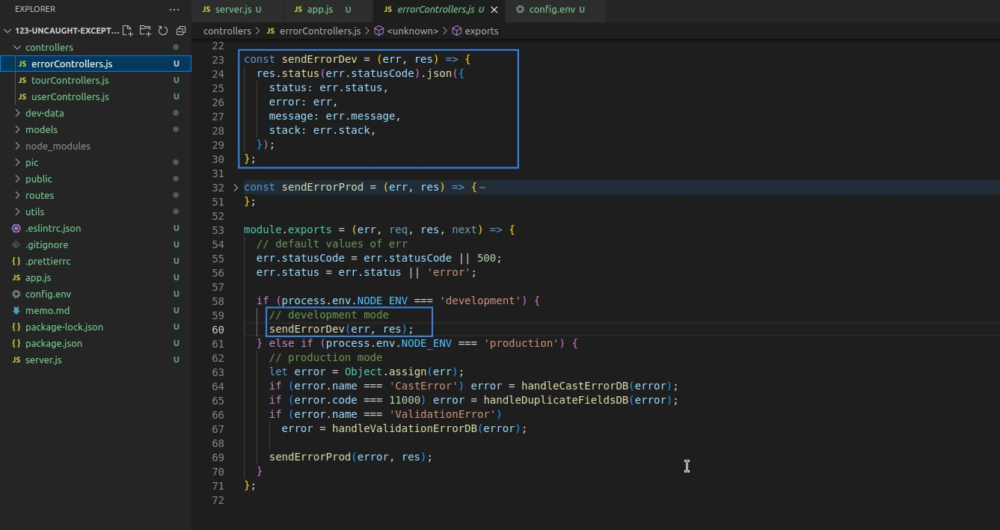

## **Create a synchronous error**

## **Build Listener to 'uncaughtException'**

- Similar to the previous lector, we also use a listener to globally catch the synchronous errors that occur in the entire app and handle them.

- In fact, some people think that we shouldn't use this generic or global approach to catch errors at all, and that we should catch them individually with method "catch".
  - However, the lecturer believes that this generic and global approach has its merits.

## **Order problem**

> Because it is synchronous, the listener must be executed before the error instruction, otherwise it cannot catch the error instruction.

## **Synchronous error in the middleware**

- So, if a synchronous error occurs in the middleware, it will be delivered directly to the global error handler middleware, and the listener part will not play any role.
